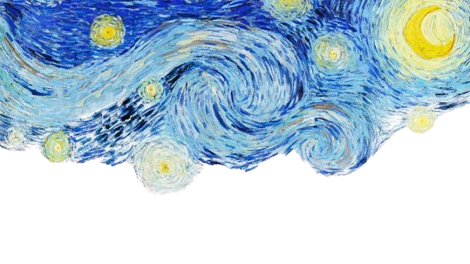

<div align="center">
<!-- Starry Night Header -->

<!-- Animated Typing Effect -->
<!-- Animated Typing Effect -->

[](https://git.io/typing-svg)

<!-- Profile Views & Followers -->


[](https://github.com/brianinguito)

---

### 🎭 _"Code is poetry, design is art, music is the soul"_

</div>

---

## 🌙 About Me


```typescript
const brian = {
    identity: "Brian Inguito",
    role: "BSIT Student",
    passions: ["Digital Art", "Traditional Art", "Music", "Code"],
    location: "Philippines 🇵🇭",
    education: "BS Information Technology",

    currentlyLearning: [
        "Full-Stack Development",
        "UI/UX Design Principles",
        "Digital Illustration Techniques"
    ],

    lifePhilosophy: "Every line of code is a brushstroke,
                     every design is a composition,
                     every note is an expression"
};
```

### 🎨 Creative Technologist

I'm a **BSIT student** who bridges the gap between technology and creativity. By day, I craft elegant code and stunning designs. By night, I create art and fill the air with music. My world is where **algorithms meet aesthetics**, and **functions harmonize with melodies**.

<br clear="right"/>

---

## 🎯 What I Do

<div align="center">

<table>
<tr>
<td width="33%" align="center">

### 💻 Technology

**Web Development**

- Frontend & Backend

**MObile Development**

- Frontend & Backend

**Design Tools**

- Figma
- Photoshop
- Canva

</td>
<td width="33%" align="center">

### 🎨 Visual Arts

**Digital Art**

- Digital Illustration
- Graphic Design
- UI/UX Design

**Traditional Art**

- Portrait Drawing
- Painting
- Sketching

</td>
<td width="33%" align="center">

### 🎵 Music

**Church Musician**

- Guitar 🎸
- Piano 🎹
- Drums 🥁
- Bass 🎸

</td>
</tr>
</table>

</div>

---

## 🛠️ My Creative Arsenal

<div align="center">

### 💻 Development Stack


### 🎨 Design & Creative Tools


### 🗄️ Database & Backend


### 📱 Mobile & Other Tech


</div>

---

## 🎨 My Passions & Hobbies

<div align="center">

<table>
<tr>
<td align="center" width="25%">
<br/>
<b>📚 Reading</b><br/>
<sub>Japanese Books<br/>Anime & Manga</sub>
</td>
<td align="center" width="25%">
<br/>
<b>🎨 Drawing</b><br/>
<sub>Portrait Art<br/>Digital Illustration</sub>
</td>
<td align="center" width="25%">
<br/>
<b>🎵 Music</b><br/>
<sub>Church Worship<br/>Multi-instrumentalist</sub>
</td>
<td align="center" width="25%">
<br/>
<b>💻 Coding</b><br/>
<sub>Web Development<br/>Creative Solutions</sub>
</td>
</tr>
</table>

### 🎸 Musical Instruments I Play

| Guitar | Piano | Drums | Bass |
| :----: | :---: | :---: | :--: |
|   🎸   |  🎹   |  🥁   |  🎸  |

</div>

---

## 📊 GitHub Analytics

<div align="center">
  
  
  

</div>

<div align="center">
  
  [](https://git.io/streak-stats)

</div>

---

## 🏆 GitHub Trophies

<div align="center">
  
  [](https://github.com/ryo-ma/github-profile-trophy)

</div>

---

## 📈 Contribution Graph

[](https://github.com/ashutosh00710/github-readme-activity-graph)

---

## 🎯 Current Focus

<div align="center">

```ascii
┌─────────────────────────────────────────────────────────┐
│                                                         │
│  🎓  Mastering Full-Stack Development                  │
│  🎨  Enhancing Digital Art Portfolio                   │
│  🎵  Serving as Church Musician                        │                     
│  🖌️  Creating Portrait Masterpieces                    │
│  💼  Building Professional Projects                    │
│                                                         │
└─────────────────────────────────────────────────────────┘
```

### 💡 Areas of Expertise

**Web Development** • **Graphic Design** • **UI/UX Design** • **Digital Art** • **Traditional Art** 

### 🌱 Currently Learning

- Vue.js 3 Composition API
- Advanced Digital Illustration Techniques
- Mobile App Development with Flutter

</div>

---

## 🌐 Connect With Me

<div align="center">

[](https://www.linkedin.com/in/brianinguito/)
[](https://www.facebook.com/brian.inguito.71/)
[](https://www.instagram.com/yangoghh/)
[](mailto:brianperezinguito@gmail.com)
[](https://brianinguito.vercel.app/)

</div>

---

## 💭 Random Dev Quote

<div align="center">


</div>

---

## 🎨 Fun Facts About Me

<div align="center">

| 🌟  | Category              | Details                                   |
| :-: | :-------------------- | :---------------------------------------- |
| 📖  | **Currently Reading** | Japanese self-help books & manga          |
| 🎨  | **Favorite Medium**   | Digital + Traditional mixed media         |
| 🎵  | **Music Genre**       | Worship, Lo-fi, Jazz,                     |
| 🌙  | **Peak Productivity** | Late night creative sessions              |
| 🎯  | **Life Motto**        | "Create, Code, Compose, Repeat"           |
| 🖌️  | **Art Style**         | Realistic portraits with a touch of anime |

</div>

---

<div align="center">

### 🌟 "Great things are done by a series of small things brought together." 🌟


**Thanks for visiting! Feel free to explore my repositories and don't hesitate to reach out for collaborations!** 😊

---


**✨ by Brian Inguito ✨**

_"Every pixel tells a story, every note carries emotion, every line of code solves a problem"_

</div>
